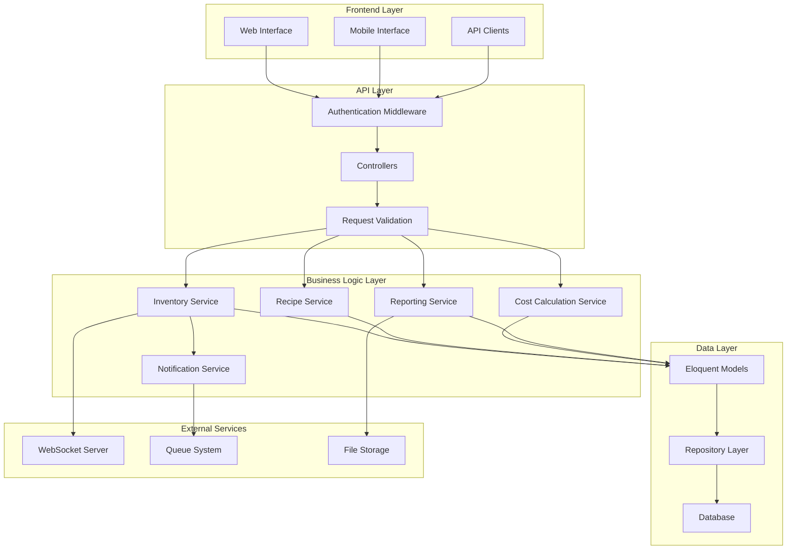

# Enhanced Restaurant POS System - Design Document

## Overview

This design document outlines the architecture and implementation approach for enhancing the existing Laravel-based restaurant POS system. The enhancements will build upon the current solid foundation while adding advanced inventory management, real-time stock tracking, comprehensive recipe costing, and improved analytics capabilities.

The design maintains backward compatibility with the existing system while introducing new features through additional models, services, and API endpoints. The system will leverage Laravel's existing featurencluding Eloquent ORM, job queues, WebSocket broadcasting, and the current JWT authentication system.

## Architecture

### System Architecture Principles

1. **Modular Design**: New features are implemented as separate modules that integrate with existing components
2. **Event-Driven Architecture**: Stock movements and inventory changes trigger events for real-time updates
3. **Service Layer Pattern**: Business logic is encapsulated in service classes for better maintainability
4. **Repository Pattern**: Data access is abstracted through repository interfaces
5. **CQRS Approach**: Separate read and write operations for complex inventory queries

### High-Level Architecture



## Components and Interfaces

### Enhanced Models

#### 1. Enhanced Material Model

```php
class Material extends Model
{
    // Existing fields plus:
    protected $fillable = [
        // ... existing fields
        'minimum_stock_level',
        'maximum_stock_level',
        'reorder_point',
        'reorder_quantity',
        'default_supplier_id',
        'storage_location',
        'shelf_life_days',
        'is_perishable',
        'barcode',
        'sku',
        'category_id'
    ];

    // New relationships
    public function supplier() { return $this->belongsTo(Supplier::class, 'default_supplier_id'); }
    public function stockAlerts() { return $this->hasMany(StockAlert::class); }
    public function stockBatches() { return $this->hasMany(StockBatch::class); }
    public function materialCategory() { return $this->belongsTo(MaterialCategory::class, 'category_id'); }
}
```

#### 2. New Supplier Model

```php
class Supplier extends Model
{
    protected $fillable = [
        'name', 'contact_person', 'email', 'phone', 'address',
        'payment_terms', 'lead_time_days', 'minimum_order_amount',
        'is_active', 'rating', 'notes'
    ];

    public function materials() { return $this->hasMany(Material::class, 'default_supplier_id'); }
    public function purchaseOrders() { return $this->hasMany(PurchaseOrder::class); }
    public function materialReceipts() { return $this->hasMany(MaterialReceipt::class); }
}
```

#### 3. New StockBatch Model (for FIFO tracking)

```php
class StockBatch extends Model
{
    protected $fillable = [
        'material_id', 'batch_number', 'quantity', 'remaining_quantity',
        'unit_cost', 'received_date', 'expiry_date', 'supplier_id',
        'material_receipt_id'
    ];

    public function material() { return $this->belongsTo(Material::class); }
    public function supplier() { return $this->belongsTo(Supplier::class); }
    public function materialReceipt() { return $this->belongsTo(MaterialReceipt::class); }
}
```

#### 4. Enhanced Recipe Model

```php
class Recipe extends Model
{
    protected $fillable = [
        'product_id', 'name', 'instructions', 'preparation_time',
        'cooking_time', 'serving_size', 'cost_per_serving',
        'version', 'is_active', 'created_by'
    ];

    public function recipeVersions() { return $this->hasMany(RecipeVersion::class); }
    public function costCalculations() { return $this->hasMany(RecipeCostCalculation::class); }
}
```

#### 5. New StockAlert Model

```php
class StockAlert extends Model
{
    protected $fillable = [
        'material_id', 'alert_type', 'threshold_value', 'current_value',
        'message', 'is_resolved', 'resolved_at', 'resolved_by'
    ];

    const ALERT_TYPES = [
        'low_stock', 'out_of_stock', 'expiry_warning',
        'expiry_critical', 'overstock'
    ];
}
```

### Service Classes

#### 1. InventoryService

```php
class InventoryService
{
    public function processReceipt(MaterialReceipt $receipt): void;
    public function processConsumption(Order $order): void;
    public function adjustStock(Material $material, float $quantity, string $reason): void;
    public function checkStockLevels(): Collection;
    public function generateStockAlerts(): void;
    public function calculateStockValue(Material $material = null): float;
    public function getStockMovements(array $filters = []): Collection;
}
```

#### 2. CostCalculationService

```php
class CostCalculationService
{
    public function calculateRecipeCost(Recipe $recipe): RecipeCostCalculation;
    public function calculateProductCostFIFO(Product $product): float;
    public function calculateTheoreticalVsActualCost(Product $product, Carbon $startDate, Carbon $endDate): array;
    public function updateProductCosts(): void;
    public function generateCostAnalysisReport(array $filters = []): array;
}
```

#### 3. ReportingService

```php
class ReportingService
{
    public function generateInventoryReport(array $filters = []): array;
    public function generateCostAnalysisReport(array $filters = []): array;
    public function generateProfitabilityReport(array $filters = []): array;
    public function generateWasteReport(array $filters = []): array;
    public function exportReport(string $reportType, string $format, array $filters = []): string;
}
```

### API Endpoints

#### Enhanced Inventory Endpoints

```
GET    /api/inventory/dashboard          - Inventory overview dashboard
GET    /api/inventory/materials          - List materials with stock info
POST   /api/inventory/materials          - Create new material
PUT    /api/inventory/materials/{id}     - Update material
DELETE /api/inventory/materials/{id}     - Delete material

GET    /api/inventory/stock-alerts       - Get active stock alerts
POST   /api/inventory/stock-alerts/resolve/{id} - Resolve stock alert

GET    /api/inventory/batches            - List stock batches
GET    /api/inventory/batches/{material} - Get batches for material

POST   /api/inventory/adjustments        - Create stock adjustment
GET    /api/inventory/movements          - Get stock movement history

GET    /api/inventory/valuation          - Get inventory valuation
```

#### Supplier Management Endpoints

```
GET    /api/suppliers                    - List suppliers
POST   /api/suppliers                    - Create supplier
PUT    /api/suppliers/{id}               - Update supplier
DELETE /api/suppliers/{id}               - Delete supplier
GET    /api/suppliers/{id}/performance   - Get supplier performance metrics
```

#### Enhanced Recipe Endpoints

```
GET    /api/recipes/{id}/cost-analysis   - Get recipe cost breakdown
POST   /api/recipes/{id}/calculate-cost  - Recalculate recipe cost
GET    /api/recipes/{id}/versions        - Get recipe version history
POST   /api/recipes/{id}/versions        - Create new recipe version
```

#### Reporting Endpoints

```
GET    /api/reports/inventory            - Inventory reports
GET    /api/reports/cost-analysis        - Cost analysis reports
GET    /api/reports/profitability        - Profitability reports
GET    /api/reports/waste                - Waste reports
POST   /api/reports/export               - Export reports
GET    /api/reports/scheduled            - List scheduled reports
POST   /api/reports/schedule             - Schedule report
```

## Data Models

### Database Schema Enhancements

#### Enhanced Materials Table

```sql
ALTER TABLE materials ADD COLUMN minimum_stock_level DECIMAL(10,3) DEFAULT 0;
ALTER TABLE materials ADD COLUMN maximum_stock_level DECIMAL(10,3) DEFAULT 0;
ALTER TABLE materials ADD COLUMN reorder_point DECIMAL(10,3) DEFAULT 0;
ALTER TABLE materials ADD COLUMN reorder_quantity DECIMAL(10,3) DEFAULT 0;
ALTER TABLE materials ADD COLUMN default_supplier_id BIGINT UNSIGNED NULL;
ALTER TABLE materials ADD COLUMN storage_location VARCHAR(100) NULL;
ALTER TABLE materials ADD COLUMN shelf_life_days INT NULL;
ALTER TABLE materials ADD COLUMN is_perishable BOOLEAN DEFAULT FALSE;
ALTER TABLE materials ADD COLUMN barcode VARCHAR(100) NULL;
ALTER TABLE materials ADD COLUMN sku VARCHAR(100) NULL;
ALTER TABLE materials ADD COLUMN category_id BIGINT UNSIGNED NULL;
```

#### New Tables

**suppliers table:**

```sql
CREATE TABLE suppliers (
    id BIGINT UNSIGNED AUTO_INCREMENT PRIMARY KEY,
    name VARCHAR(255) NOT NULL,
    contact_person VARCHAR(255) NULL,
    email VARCHAR(255) NULL,
    phone VARCHAR(50) NULL,
    address TEXT NULL,
    payment_terms VARCHAR(100) NULL,
    lead_time_days INT DEFAULT 0,
    minimum_order_amount DECIMAL(10,2) DEFAULT 0,
    is_active BOOLEAN DEFAULT TRUE,
    rating DECIMAL(3,2) NULL,
    notes TEXT NULL,
    created_at TIMESTAMP NULL,
    updated_at TIMESTAMP NULL
);
```

**stock_batches table:**

```sql
CREATE TABLE stock_batches (
    id BIGINT UNSIGNED AUTO_INCREMENT PRIMARY KEY,
    material_id BIGINT UNSIGNED NOT NULL,
    batch_number VARCHAR(100) NOT NULL,
    quantity DECIMAL(10,3) NOT NULL,
    remaining_quantity DECIMAL(10,3) NOT NULL,
    unit_cost DECIMAL(10,2) NOT NULL,
    received_date DATE NOT NULL,
    expiry_date DATE NULL,
    supplier_id BIGINT UNSIGNED NULL,
    material_receipt_id BIGINT UNSIGNED NULL,
    created_at TIMESTAMP NULL,
    updated_at TIMESTAMP NULL,
    INDEX idx_material_received (material_id, received_date),
    INDEX idx_expiry_date (expiry_date)
);
```

**stock_alerts table:**

```sql
CREATE TABLE stock_alerts (
    id BIGINT UNSIGNED AUTO_INCREMENT PRIMARY KEY,
    material_id BIGINT UNSIGNED NOT NULL,
    alert_type ENUM('low_stock', 'out_of_stock', 'expiry_warning', 'expiry_critical', 'overstock') NOT NULL,
    threshold_value DECIMAL(10,3) NULL,
    current_value DECIMAL(10,3) NULL,
    message TEXT NOT NULL,
    is_resolved BOOLEAN DEFAULT FALSE,
    resolved_at TIMESTAMP NULL,
    resolved_by BIGINT UNSIGNED NULL,
    created_at TIMESTAMP NULL,
    updated_at TIMESTAMP NULL,
    INDEX idx_material_type (material_id, alert_type),
    INDEX idx_unresolved (is_resolved, created_at)
);
```

**recipe_cost_calculations table:**

```sql
CREATE TABLE recipe_cost_calculations (
    id BIGINT UNSIGNED AUTO_INCREMENT PRIMARY KEY,
    recipe_id BIGINT UNSIGNED NOT NULL,
    calculation_date TIMESTAMP NOT NULL,
    total_cost DECIMAL(10,2) NOT NULL,
    cost_per_serving DECIMAL(10,2) NOT NULL,
    calculation_method ENUM('average', 'fifo', 'lifo') DEFAULT 'fifo',
    cost_breakdown JSON NULL,
    calculated_by BIGINT UNSIGNED NULL,
    created_at TIMESTAMP NULL,
    updated_at TIMESTAMP NULL
);
```

## Error Handling

### Error Categories

1. **Validation Errors**: Invalid input data, constraint violations
2. **Business Logic Errors**: Insufficient stock, invalid operations
3. **System Errors**: Database connectivity, external service failures
4. **Authorization Errors**: Insufficient permissions, expired tokens

### Error Response Format

```json
{
    "success": false,
    "error": {
        "code": "INSUFFICIENT_STOCK",
        "message": "Insufficient stock for material: Flour",
        "details": {
            "material_id": 123,
            "required_quantity": 5.5,
            "available_quantity": 2.3,
            "unit": "kg"
        }
    },
    "timestamp": "2024-01-15T10:30:00Z"
}
```

### Error Handling Strategy

1. **Graceful Degradation**: System continues operating with reduced functionality
2. **Automatic Recovery**: Retry mechanisms for transient failures
3. **User Notification**: Clear error messages with actionable guidance
4. **Logging**: Comprehensive error logging for debugging and monitoring

## Testing Strategy

### Unit Testing

-   Model relationships and business logic
-   Service class methods and calculations
-   Helper functions and utilities
-   Validation rules and constraints

### Integration Testing

-   API endpoint functionality
-   Database transactions and rollbacks
-   External service integrations
-   WebSocket event broadcasting

### Feature Testing

-   Complete user workflows
-   Stock movement scenarios
-   Cost calculation accuracy
-   Report generation and export

### Performance Testing

-   Database query optimization
-   Large dataset handling
-   Concurrent user scenarios
-   Real-time update performance

### Test Data Management

-   Factory classes for test data generation
-   Database seeding for consistent test environments
-   Mock external services and dependencies
-   Automated test data cleanup

## Implementation Phases

### Phase 1: Core Infrastructure

-   Enhanced models and migrations
-   Basic service classes
-   Updated API endpoints
-   Database schema changes

### Phase 2: Inventory Management

-   Stock batch tracking
-   FIFO cost calculations
-   Stock alerts and notifications
-   Inventory adjustments

### Phase 3: Recipe and Cost Management

-   Enhanced recipe management
-   Cost calculation services
-   Profitability analysis
-   Recipe versioning

### Phase 4: Reporting and Analytics

-   Report generation services
-   Data export functionality
-   Scheduled reports
-   Dashboard enhancements

### Phase 5: Advanced Features

-   Mobile optimization
-   Multi-location support
-   Integration capabilities
-   Performance optimizations

## Security Considerations

### Data Protection

-   Sensitive data encryption at rest
-   Secure API communication (HTTPS)
-   Input validation and sanitization
-   SQL injection prevention

### Access Control

-   Role-based permissions
-   API rate limiting
-   Session management
-   Audit logging

### Business Data Security

-   Cost information access control
-   Supplier data protection
-   Inventory data integrity
-   Financial data encryption

## Performance Optimization

### Database Optimization

-   Proper indexing strategy
-   Query optimization
-   Connection pooling
-   Read replicas for reporting

### Caching Strategy

-   Redis for session storage
-   Query result caching
-   API response caching
-   Static asset caching

### Real-time Updates

-   Efficient WebSocket usage
-   Event-driven updates
-   Selective data broadcasting
-   Connection management

This design provides a comprehensive foundation for implementing the enhanced restaurant POS system while maintaining compatibility with the existing codebase and ensuring scalability for future growth.
